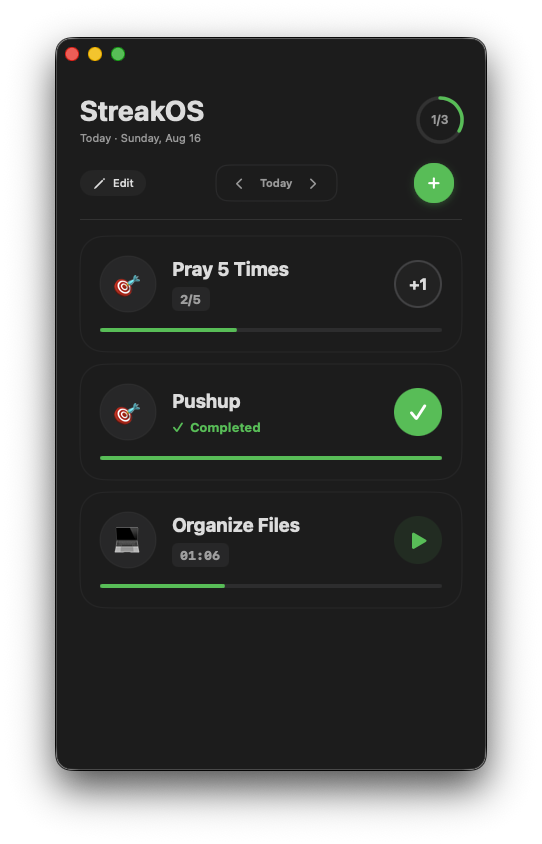
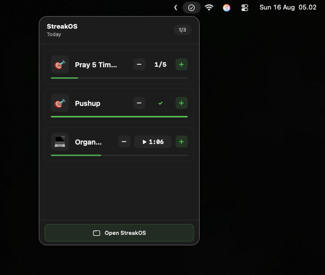

# 🔥 StreakOS

A minimalist, offline-first habit & task tracker for the Apple ecosystem — native macOS, iOS/iPadOS, and a watchOS companion.


StreakOS replaces the checkbox-and-list approach with a single interaction pattern: every habit is a counter you **increment**. No checkbox, no tabs, no config. Create an item with a daily target, tap **+** until it's done, and let the daily reset start fresh the next day — synced automatically across all your Apple devices via SwiftData + CloudKit.

---

## Engineering Highlights

- **Three-target modular architecture** — `StreakOSFramework` (pure domain + infrastructure), `StreakOSPresentation` (framework-free ViewModels), and three composition-root apps (`StreakOSMacApp`, `StreakOSApp`, `StreakOSWatchApp`). Domain and presentation targets import zero UIKit/SwiftUI.
- **All ViewModels tested for memory leaks** — every `makeSUT()` factory calls `trackForMemoryLeaks()` via `addTeardownBlock` to catch retain cycles automatically.
- **iCloud sync with zero config** — `StreakOSModelContainer.makeCloudKitEnabled()` boots SwiftData against CloudKit with no user toggle. Every platform registers for remote notifications (`registerForRemoteNotifications`) and reloads on `NSPersistentStoreRemoteChange`, so changes propagate live across Mac, iPhone, and Apple Watch.
- **Intelligent timer semantics** — minute-based habits accrue elapsed wall-clock time into `currentCount` on pause and display live `MM:SS` via `TimelineView`. Restart, manual adjust, and completion are all captured in one pure `DailyRecord` value.
- **Enforced date-editing window** — `DateNavigationWindow` allows editing today and the last 7 days, read-only access to tomorrow, and locks out everything else — a single unit-tested source of truth shared by all platforms.

---

## Table of Contents

1. [Getting Started](#1-getting-started)
2. [App Features](#2-app-features)
3. [Architecture](#3-architecture)
4. [Testing](#4-testing)
5. [Known Limitations & Roadmap](#5-known-limitations--roadmap)

---

## 1. Getting Started

### Prerequisites

- macOS 14.0 or later
- Xcode 16.0 or later
- An Apple Developer team for CloudKit sync (simulator works locally without it)

### Installation

1. Clone the repository:
   ```bash
   git clone https://github.com/aminfaruq/streakOS-project.git
   cd streakOS-project
   ```

2. Open the workspace:
   ```bash
   open StreakOSApp.xcworkspace
   ```

3. Configure code signing:
   - Select a target (e.g., `StreakOSApp`) in Xcode
   - Go to **Signing & Capabilities**
   - Select your development team
   - Add the **iCloud** capability with the **CloudKit** service and container `iCloud.com.aminfaruq.StreakOS`
   - Add the **Push Notifications** capability
   - Repeat for each app target you plan to run: `StreakOSMacApp`, `StreakOSApp`, `StreakOSWatchApp`

4. Build and run:
   - Pick a scheme (`StreakOSMacApp`, `StreakOSApp`, or `StreakOSWatchApp`)
   - Press `Cmd+R` or click the Run button

### Project Structure

The workspace `StreakOSApp.xcworkspace` references four Xcode projects:

- **StreakOSFramework/** — Domain + infrastructure framework (opens in any of the app targets)
- **StreakOSPresentation/** — Presentation layer (ViewModels), built inside the same framework project
- **StreakOSMacApp/** — macOS app (native SwiftUI, hidden title bar + menu bar extra)
- **StreakOSApp/** — iOS/iPadOS app (SceneDelegate composition root)
- **StreakOSWatchApp/** — watchOS companion app

---

## 2. App Features

### Single Interaction Pattern

All items behave the same regardless of target size — tap **+** to increment, and the card transforms into a **✓** when the target is reached.

| Target | How to Complete | Completion Indicator |
|---|---|---|
| 1 | Tap **+** once | Card shows ✓ |
| 5 | Tap **+** five times | Counter shows 5/5, card shows ✓ |

Completed items are read-only on the main screen. The only way to un-complete is the **actions sheet** (long-press/tap → **Restart** or **−**).

### Count Items

Counter-based habits with a `1...999` daily target. The target field is a keyboard-friendly digits-only input (letters and decimals are stripped on every keystroke), and the minus button lives in the actions sheet to prevent accidental decrements.

### Timer (Minutes) Items

Minute-based habits measure elapsed time rather than taps:

- **Play/Pause:** Tapping play records `timerStartDate`; pausing folds elapsed wall-clock time into `currentCount`.
- **Live progress:** Cards use `TimelineView(.periodic, by: 1.0)` to render ticking `MM:SS` and a spring-animated progress bar.
- **Completion:** A timer habit completes when accrued seconds reach `targetCount * 60`.

### Actions Sheet

Tap any item card to open the bottom sheet with:

- **Adjust** — a large − / + stepper and live counter
- **Restart Progress** — resets today's record to zero (disabled when already zero)
- **Edit Item** — rename, change icon, retarget, or shift dates
- **Duplicate** — creates "Name 2", "Name 3", … via `ItemNameGenerator`
- **Delete** — destructive, confirmed via a system confirmation dialog that warns history is removed too

### Date Navigation

`DateNavigationWindow` defines the edit window enforced on every screen:

| Date Range | Status |
|---|---|
| Today | Full read-write |
| 1–7 days ago | Full read-write (correct yesterday) |
| More than 7 days ago | Inaccessible |
| Tomorrow | Read-only (view, cannot change) |
| More than 1 day ahead | Inaccessible |

Navigating to a past day lets you fix mistakes; future days are grayed out and disabled.

### Edit & Reorder Mode

Toggle **Edit** to enter edit mode: cards scale down, a drag handle appears, and items can be reordered with drag-and-drop. `ItemReorder.reorder()` recomputes `displayOrder`, and the new order is persisted sequentially through `ItemUpdater`.

### Activity Ring

The header shows a live completion ring (`completedCount / totalItems`) that springs to its new value whenever any item completes.

### Menu Bar Extra (macOS)

The Mac app includes a `MenuBarExtra` that renders today's items with inline − / + and play / pause controls, a running completion count, and a link to open the main window — habit tracking without leaving your current context.

### watchOS Companion

A watch companion app lists today's items and supports quick increment / timer toggling, sharing the same CloudKit-backed data store and remote-change reload.

### Cross-Device Sync

All platforms register for remote notifications and listen for `NSPersistentStoreRemoteChange` (debounced 500ms) to reload. Changes made on your Mac appear on your iPhone and Watch without any manual action.

---

## 3. Architecture

### Module Structure

```
StreakOSFramework.xcodeproj/         ← framework project with 3 targets
├── StreakOSFramework/               ← Domain + Infrastructure framework
│   ├── Domain/
│   │   ├── Models/                  ← Item, DailyRecord
│   │   ├── Protocols/               ← DailyProgressLoader, ProgressTracker, ItemStore,
│   │   │                              ItemCreator, ItemUpdater, ItemDuplicator, DailyRecordStore
│   │   └── ValueObjects/            ← ItemType, ItemProgress, DateNavigationWindow,
│   │                                  ItemNameGenerator, ItemReorder
│   └── Infrastructure/
│       ├── Adapters/                ← LocalDailyProgressLoader, LocalProgressTracker,
│       │                              LocalItemCreator/Updater/Duplicator,
│       │                              SwiftDataItemStore, SwiftDataDailyRecordStore
│       ├── Mappers/                 ← SDItemMapper, SDDailyRecordMapper
│       └── Persistence/             ← StreakOSModelContainer, SwiftData/SDItem, SDDailyRecord
├── StreakOSPresentation/            ← Presentation framework (ViewModels only)
│   └── ProgressFeedViewModel.swift, ItemFormViewModel.swift
└── StreakOSPresentationTests/

StreakOSMacApp/                      ← macOS composition root
├── AppCore/AppComposer.swift
├── DesignSystem/DesignTokens.swift
└── Views/                           ← ProgressListView, AddItemView, ItemCardView,
                                       ItemActionsView, DateHeaderView, MenuBarProgressView

StreakOSApp/                         ← iOS composition root
├── AppCore/AppComposer.swift        ← dependency injection entry point
├── DesignSystem/IOSDesignTokens.swift
└── Views/                           ← IOSProgressListView, IOSItemCardView,
                                       IOSItemActionsSheet, IOSAddItemView, IOSDateHeaderView

StreakOSWatchApp/                    ← watchOS composition root
├── AppCore/AppComposer.swift
└── WatchProgressListView, WatchItemRow
```

### Dependency Direction

```
StreakOSMacApp ──┐
StreakOSApp    ──┤→ StreakOSPresentation → StreakOSFramework
StreakOSWatchApp┘
```

The domain layer (`Domain/Protocols/`) defines the contracts (`DailyProgressLoader`, `ProgressTracker`, `ItemStore`, …). Infrastructure adapters conform to them. ViewModels depend only on domain types and Combine — they never import SwiftUI or UIKit. Each app target is a thin composition root that wires concrete adapters into ViewModels.

### Composition Roots

Each platform owns a small `AppComposer`:

- **macOS:** `StreakOSMacApp` is the `@main` SwiftUI `App`; it bootstraps dependencies in `init()` and injects them into views.
- **iOS:** `SceneDelegate.willConnectTo` bootstraps via `AppComposer.makeDependencies()` and installs a `UIHostingController`. A convenience initializer allows test doubles to be injected for UI tests.
- **watchOS:** the watch `App` builds its own composer instance.

All three call `AppComposer.makeDependencies()`, which creates a CloudKit-enabled `ModelContainer`, the SwiftData stores, and the local adapters, then assembles a shared `ProgressFeedViewModel`.

### Persistence

| Data | Storage | Mechanism |
|---|---|---|
| Items & daily records | SwiftData on CloudKit (`ModelConfiguration(cloudKitDatabase: .automatic)`) | `SDItem` / `SDDailyRecord` SwiftData models mapped to pure domain structs via `SDItemMapper` / `SDDailyRecordMapper` |
| In-memory tests | In-memory `ModelContainer` | `StreakOSModelContainer.makeInMemory()` |
| Remote change broadcast | `NSPersistentStoreRemoteChange` | Debounced 500ms reload on all platforms |

### Business Logic Highlights

- `DailyRecord` is an immutable value type. Increment, decrement, timer toggle, and restart are all pure functions that return a new record — trivially unit-testable with no infrastructure.
- `DailyRecord.incrementing(by:)` is idempotent: once `isCompleted`, further increments are no-ops, and `decrementing` from a completed state rewinds from `targetCount`.
- `ItemNameGenerator` guarantees unique names on duplicate ("Habit", "Habit 2", "Habit 3", …) and `ItemFormViewModel` blocks saving a duplicate name.
- `ItemFormViewModel.canSave` enforces: non-empty name ≤ 100 chars, single-character icon, target within `1...999`, and `endDate >= startDate`.

---

## 4. Testing

### Test Targets & Coverage

181 test functions across 20 unit test files, split between domain/infrastructure and presentation.

**`StreakOSFrameworkTests`** — Domain & Infrastructure (18 test files):

| Area | File | What it covers |
|---|---|---|
| Domain | `ItemTests` | Model construction, `isVisible(on:)` date-window logic |
| Domain | `DailyRecordTests` | Increment/decrement/timer-toggle/restart pure functions, completion clamping, idempotency |
| Domain | `ItemProgressTests` | Progress fraction and display text for count and timer types |
| Domain | `ItemTypeTests` | Count vs minutes type mapping |
| Domain | `DateNavigationWindowTests` | Editable/read-only/inaccessible windows, backward/forward navigation |
| Domain | `ItemNameGeneratorTests` | Uniqueness and "Name 2" duplicate naming |
| Domain | `ItemReorderTests` | Order recomputation and index safety |
| Infrastructure | `LocalDailyProgressLoaderTests` | Loading items + today's records into `ItemProgress` |
| Infrastructure | `LocalProgressTrackerTests` | Increment/decrement/timer/restart delegation to the store |
| Infrastructure | `LocalItemCreatorTests` | Item creation with name uniqueness and `displayOrder` |
| Infrastructure | `LocalItemUpdaterTests` | Update persistence |
| Infrastructure | `LocalItemDuplicatorTests` | Duplicate creation and unique naming |
| Infrastructure | `SwiftDataItemStoreIntegrationTests` | SwiftData-backed item CRUD |
| Infrastructure | `SwiftDataDailyRecordStoreIntegrationTests` | SwiftData-backed record read/write |
| Infrastructure | `SDItemMapperTests`, `SDDailyRecordMapperTests` | SwiftData → domain mapping |
| Infrastructure | `StreakOSModelContainerTests` | CloudKit and in-memory container construction |

**`StreakOSPresentationTests`** — ViewModel Logic (2 test files, 100+ scenarios):

| ViewModel | Key scenarios tested |
|---|---|
| `ProgressFeedViewModelTests` | Load/success/failure states, increment/decrement/timer/restart apply results, delete/duplicate/update flows, reorder persistence, cancel-on-deinit |
| `ItemFormViewModelTests` | Create/edit validation (`canSave`), save success/failure, duplicate-name rejection, date-range validation, error messaging |

Every ViewModel test suite uses a shared `trackForMemoryLeaks()` helper registered in `addTeardownBlock` to catch retain cycles automatically. Test plans (`StreakOSFramework.xctestplan`, `StreakOSPresentation.xctestplan`) enable random test ordering and the performance antipattern checker.

### BDD-Style Specifications

Core behaviors are expressed as Given/When/Then scenarios, each with a corresponding `XCTest`:

```gherkin
Feature: Daily Reset & Completion

  Scenario: Reaching the target completes the item
    Given an item with targetCount 5
    When the user increments 5 times
    Then isCompleted becomes true
    And further increments are no-ops

  Scenario: Decrementing a completed item rewinds from the target
    Given a completed item with targetCount 5
    When the user decrements once
    Then currentCount becomes 4
    And isCompleted becomes false

  Scenario: Decrementing never goes below zero
    Given an item with currentCount 0
    When the user decrements
    Then currentCount stays 0
```

```gherkin
Feature: Timer Habits

  Scenario: Pausing accrues elapsed time
    Given a timer item with timerStartDate set
    When the user stops the timer after 65 seconds
    Then currentCount increases by 65
    And the item completes when currentCount >= targetCount * 60

  Scenario: Restarting resets the day's record
    Given an item with currentCount 3 and an active timer
    When the user restarts
    Then currentCount is 0 and timerStartDate is nil
```

```gherkin
Feature: Date Editing Window

  Scenario: Today and the past 7 days are editable
    Given today is T
    When the date is T or T - 7 days
    Then accessibility is .editable

  Scenario: Tomorrow is read-only and further out is inaccessible
    Given today is T
    When the date is T + 1 day
    Then accessibility is .readOnly
    When the date is T + 2 days
    Then accessibility is .inaccessible
```

```gherkin
Feature: Duplicate Naming

  Scenario: Duplicate appends an incrementing suffix
    Given an item named "Read"
    When the user duplicates it
    Then the new item is named "Read 2"
    And a second duplicate is named "Read 3"
```

---

## 5. Known Limitations & Roadmap

### Current Limitations

| Item | Status |
|---|---|
| **macOS Catalyst** | Intentionally disabled (`SUPPORTS_MACCATALYST = NO`); a native Mac app is the flagship target instead. |
| **Accessibility** | Not explicitly implemented beyond standard SwiftUI defaults. |
| **CloudKit entitlement** | Container is hard-coded to `iCloud.com.aminfaruq.StreakOS` — forking requires updating each target's entitlements. |
| **Notifications** | Remote-notification registration is present but silent push delivery is still being validated end-to-end. |

### Roadmap

| Feature | Platform | Status |
|---|---|---|
| **Streak analytics** | macOS, iOS | Planned. Consecutive-day streaks and completion history charts. |
| **Widgets** | iOS, macOS | Planned. Today's items on the home screen and desktop. |
| **Reminders & notifications** | macOS, iOS, watchOS | Planned. Local notifications with configurable daily reminder time. |
| **iPad layout** | iPadOS | Planned. Adaptive layout for larger screens. |
| **Search & archiving** | macOS, iOS | Planned. History browsing and archived item recovery. |

---

## 📸 Screenshots & Demo

<div align="center">
  
  <br />
  <sub><b>Mac App</b></sub>
</div>

<br />

<div align="center">
  
  <br />
  <sub><b>Menubar</b></sub>
</div>

---

## License

See [LICENSE](LICENSE) for details.
